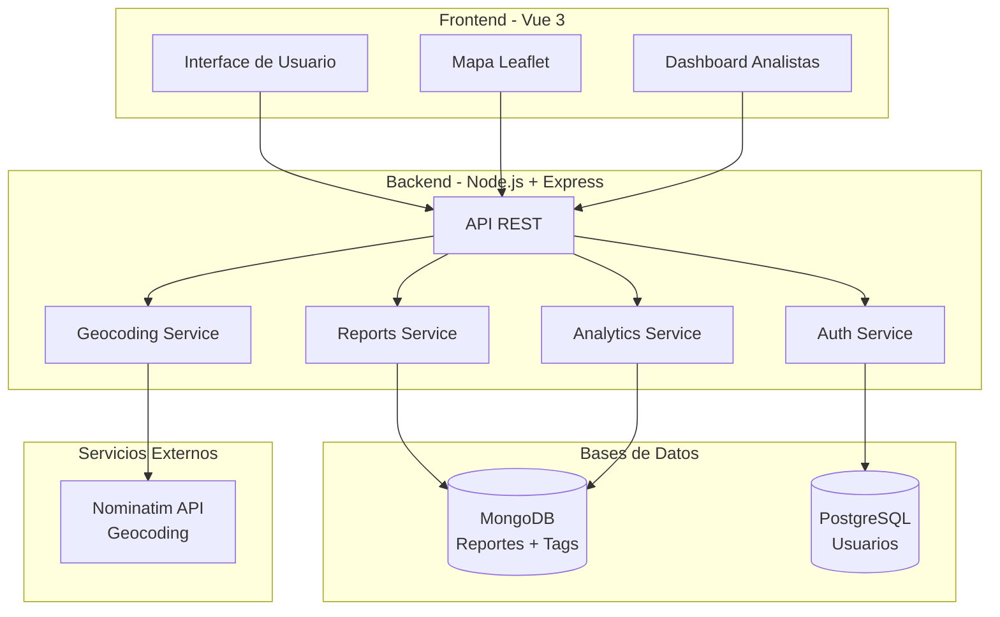
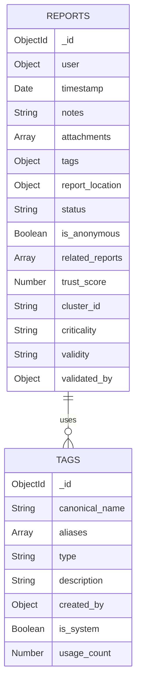
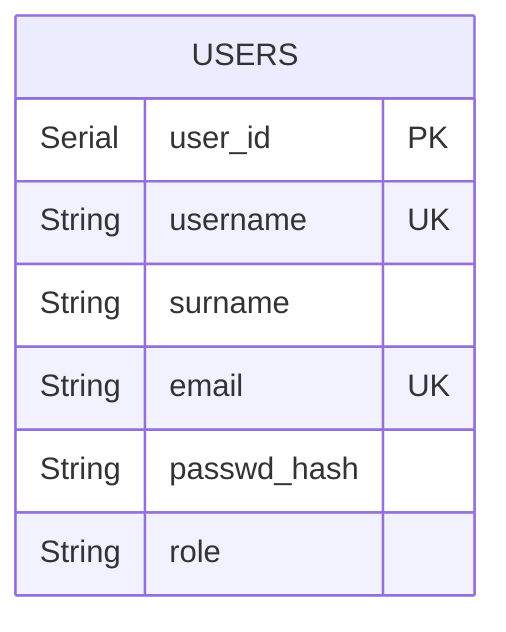
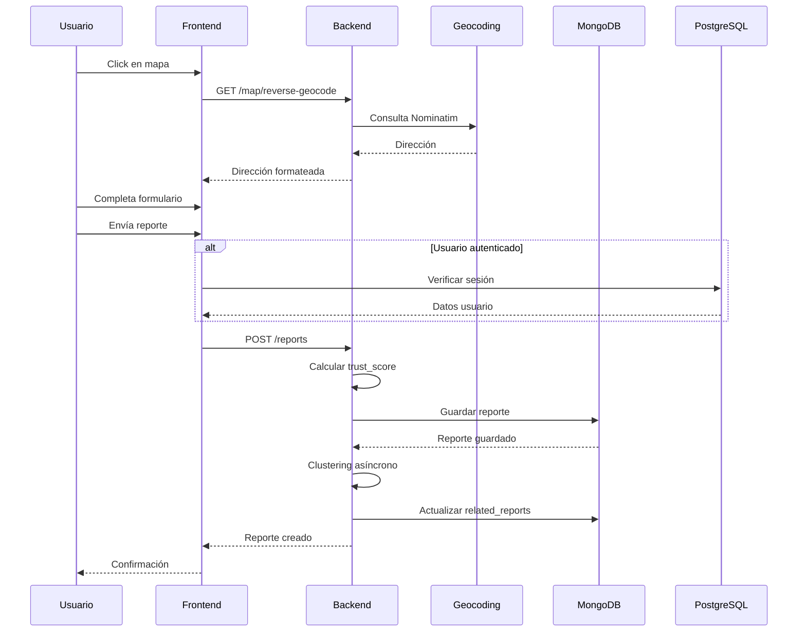
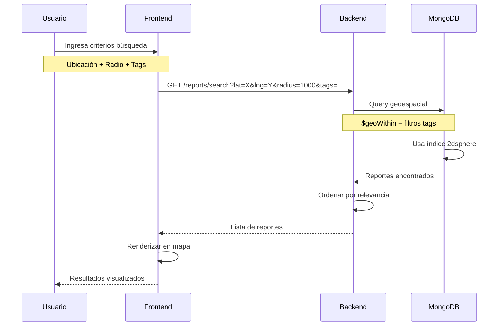
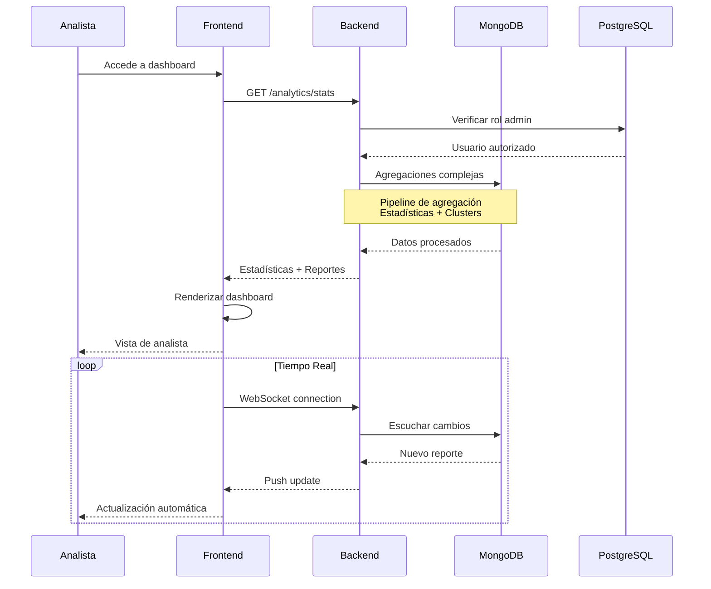
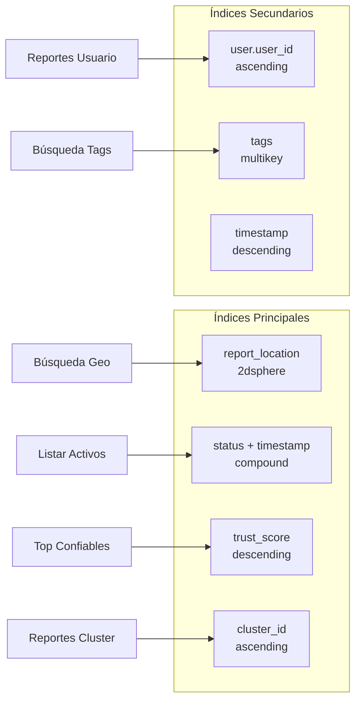
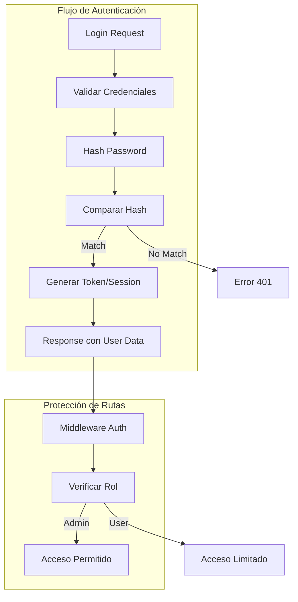
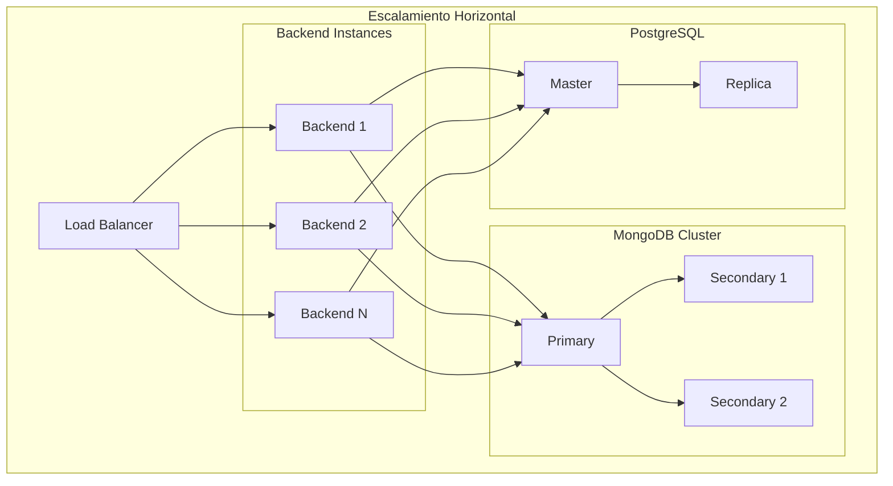

# Arquitectura del Sistema - ReportIt

## 🏗️ Visión General

ReportIt es una aplicación de reportes ciudadanos que utiliza una arquitectura de microservicios con persistencia políglota (MongoDB + PostgreSQL).

---

## 📐 Diagrama de Arquitectura General



---

## 🗄️ Modelo de Datos

### MongoDB - Colección Reports



### PostgreSQL - Tabla Users



---

## 🔄 Flujo de Datos - Crear Reporte



---

## 🔍 Flujo de Búsqueda Geoespacial



---

## 📊 Flujo de Analytics - Dashboard



---

## 🎯 Índices MongoDB Optimizados



---

## 🔐 Seguridad y Autenticación



---

## 🚀 Pipeline de Procesamiento

```mermaid
graph LR
    subgraph "Ingesta"
        I1[Reporte Nuevo]
        I2[Validación]
        I3[Geocoding]
    end
    
    subgraph "Procesamiento"
        P1[Calcular Trust Score]
        P2[Detectar Cluster]
        P3[Actualizar Related]
    end
    
    subgraph "Almacenamiento"
        S1[MongoDB Write]
        S2[Índices Update]
    end
    
    subgraph "Analytics"
        A1[Agregaciones]
        A2[Dashboard Update]
        A3[Notificaciones]
    end
    
    I1 --> I2
    I2 --> I3
    I3 --> P1
    P1 --> P2
    P2 --> P3
    P3 --> S1
    S1 --> S2
    S2 --> A1
    A1 --> A2
    A2 --> A3
```



---

## 📈 Escalabilidad



---

## 🔄 Comparación: NoSQL vs SQL

### Caso de Uso 1: Búsqueda Geoespacial

**MongoDB (Optimizado)**
```javascript
// Query nativa con índice 2dsphere
db.reports.find({
  report_location: {
    $near: {
      $geometry: { type: "Point", coordinates: [lng, lat] },
      $maxDistance: 1000
    }
  },
  status: "active"
})
```
⚡ **Tiempo:** ~50ms con índice 2dsphere

**PostgreSQL (Requiere PostGIS)**
```sql
-- Requiere extensión PostGIS
SELECT * FROM reports 
WHERE ST_DWithin(
  location::geography,
  ST_MakePoint(lng, lat)::geography,
  1000
)
AND status = 'active';
```
⚡ **Tiempo:** ~200ms con índice GiST

### Caso de Uso 2: Tags Dinámicos

**MongoDB (Schema Flexible)**
```javascript
// Tags como objeto dinámico
{
  tags: {
    "color_vehiculo": "negro",
    "patente": "ABC123",
    "nuevo_campo": "valor"  // ✅ Sin migración
  }
}
```
✅ **Ventaja:** Agregar campos sin migrar DB

**PostgreSQL (Schema Rígido)**
```sql
-- Requiere tabla separada o JSONB
CREATE TABLE report_tags (
  report_id INT,
  tag_key VARCHAR,
  tag_value VARCHAR
);
```
❌ **Desventaja:** Requiere joins o JSONB (menos eficiente)

### Caso de Uso 3: Agregaciones Complejas

**MongoDB (Aggregation Pipeline)**
```javascript
// Pipeline de agregación nativo
db.reports.aggregate([
  { $geoNear: { /* búsqueda geo */ } },
  { $match: { status: "active" } },
  { $group: { _id: "$cluster_id", count: { $sum: 1 } } },
  { $sort: { count: -1 } }
])
```
⚡ **Tiempo:** ~100ms para 10K documentos

**PostgreSQL (Múltiples Queries)**
```sql
-- Requiere múltiples queries o CTEs complejos
WITH geo_filtered AS (
  SELECT * FROM reports WHERE ...
),
grouped AS (
  SELECT cluster_id, COUNT(*) FROM geo_filtered GROUP BY cluster_id
)
SELECT * FROM grouped ORDER BY count DESC;
```
⚡ **Tiempo:** ~300ms para 10K registros

---

## 🎯 Decisiones de Diseño

### ¿Por qué MongoDB para Reportes?

1. **Geoespacial Nativo**
   - Índices 2dsphere optimizados
   - Queries de proximidad eficientes
   - Sin necesidad de extensiones

2. **Schema Flexible**
   - Tags dinámicos sin migración
   - Evolución del modelo sin downtime
   - Documentos autónomos

3. **Agregaciones Potentes**
   - Pipeline de agregación expresivo
   - Analytics en una sola query
   - Performance superior para análisis

4. **Escalabilidad Horizontal**
   - Sharding nativo
   - Replicación automática
   - Distribución geográfica

### ¿Por qué PostgreSQL para Usuarios?

1. **ACID Completo**
   - Transacciones garantizadas
   - Consistencia fuerte
   - Crítico para autenticación

2. **Integridad Referencial**
   - Foreign keys
   - Constraints
   - Validaciones a nivel DB

3. **Madurez y Herramientas**
   - Ecosistema robusto
   - Herramientas de administración
   - Amplia documentación

---

## 📊 Métricas de Performance Esperadas

| Operación | Objetivo | MongoDB | PostgreSQL |
|-----------|----------|---------|------------|
| Lectura simple | < 0.5s | ~50ms ✅ | ~30ms ✅ |
| Escritura | < 1s | ~100ms ✅ | ~80ms ✅ |
| Búsqueda geo | < 0.5s | ~50ms ✅ | ~200ms ⚠️ |
| Agregación compleja | < 1s | ~100ms ✅ | ~300ms ⚠️ |
| Tags dinámicos | N/A | Nativo ✅ | JSONB ⚠️ |

---

## 🔮 Futuras Mejoras

1. **Caching con Redis**
   - Cache de búsquedas frecuentes
   - Sessions distribuidas
   - Rate limiting

2. **Message Queue**
   - RabbitMQ o Kafka
   - Procesamiento asíncrono
   - Notificaciones en tiempo real

3. **CDN para Assets**
   - Imágenes de reportes
   - Assets estáticos
   - Mejor performance global

4. **Monitoring**
   - Prometheus + Grafana
   - Métricas en tiempo real
   - Alertas automáticas

---

**Última actualización:** 2026-05-29  
**Versión:** 1.0  
**Autor:** Equipo ReportIt